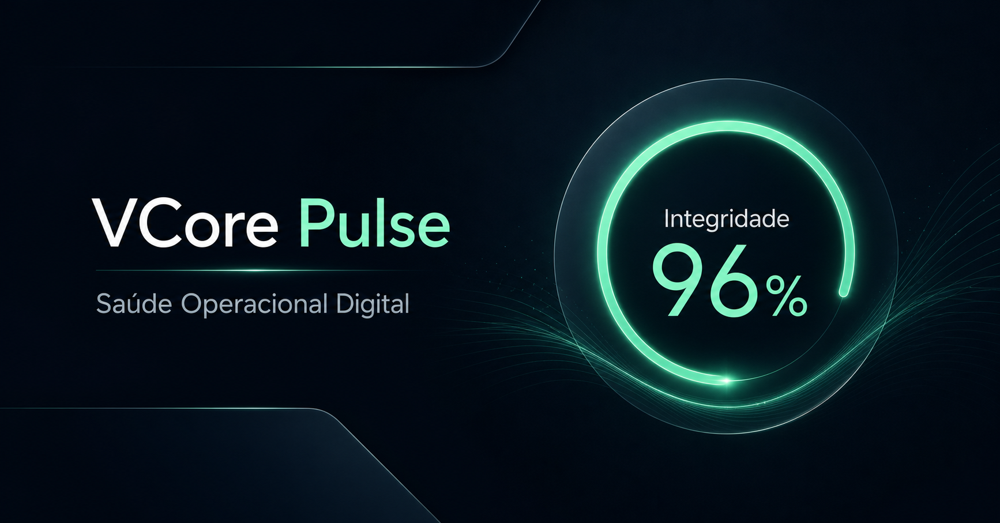
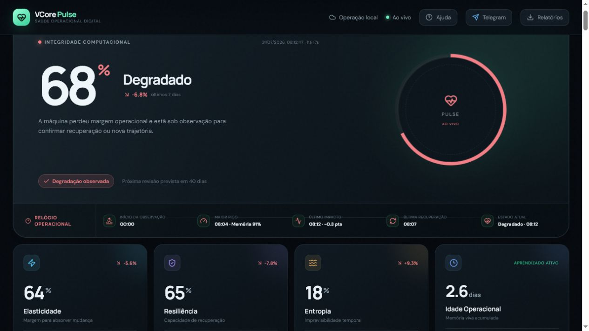
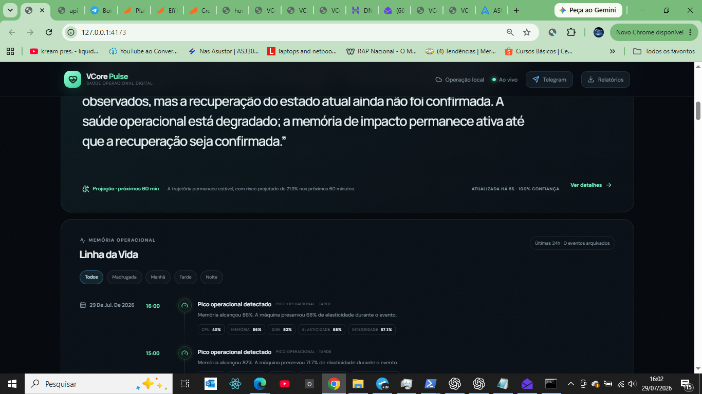
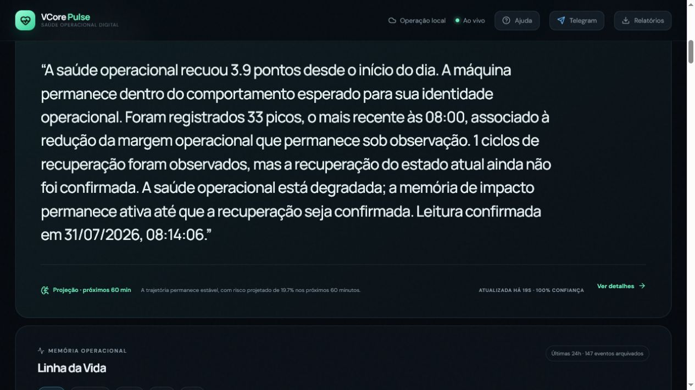
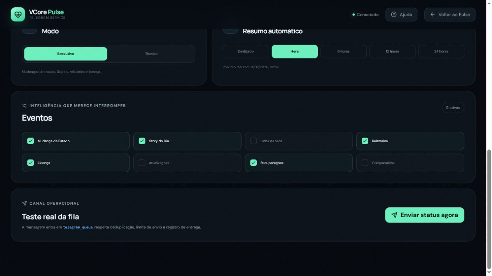
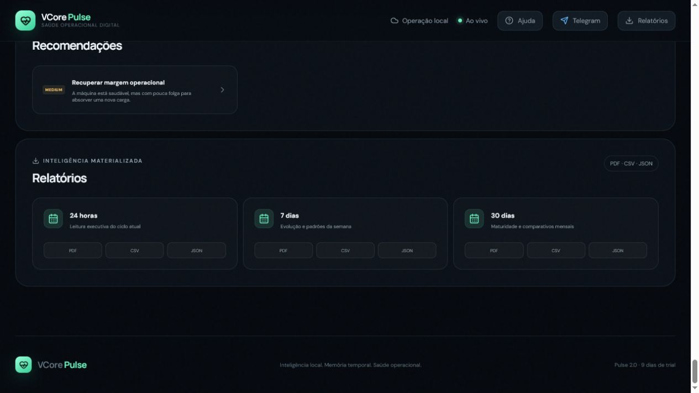

# VCore Pulse 2.0

<p align="center">



</p>

<p align="center">

[](ROADMAP.md)
[](CHANGELOG.md)
[](#installation)
[](#installation)

</p>

# Digital Operational Health

VCore Pulse é uma plataforma de **Runtime Intelligence** e **Saúde Operacional Digital**.

Ao invés de observar apenas CPU, memória, disco ou rede em um determinado instante, o Pulse interpreta a **trajetória operacional** de cada computador ao longo do tempo.

Cada máquina desenvolve sua própria identidade operacional.

O objetivo não é monitorar recursos.

O objetivo é compreender o comportamento computacional.

---

# Download

## Windows

⬇ **Download (sempre última versão)**

https://github.com/VoigtCore/VCore-PULSE/releases/latest/download/VCorePulse2.0.exe

---

## Linux

⬇ **Download (sempre última versão)**

https://github.com/VoigtCore/VCore-PULSE/releases/latest/download/VCorePulse2.0.sh

---

## Todas as versões

https://github.com/VoigtCore/VCore-PULSE/releases

---

Confira a integridade dos arquivos em:

**SHA256SUMS.txt**

---

# Public Beta

Esta versão está disponível para validação pública.

Durante as próximas semanas o algoritmo continuará sendo calibrado através do **Baseline Estrutural Temporal**, permitindo que cada máquina aprenda sua própria identidade operacional.

Feedbacks são muito bem-vindos.

📧 rafael@voigtcore.com.br

ou

https://github.com/VoigtCore/VCore-PULSE/issues

---

# Principais recursos

✔ Runtime Intelligence

✔ Saúde Operacional

✔ Integridade Computacional

✔ Elasticidade

✔ Resiliência

✔ Entropia

✔ Linha da Vida

✔ Story Executivo

✔ Timeline Temporal

✔ Telegram Bot

✔ Relatórios PDF

✔ Diagnóstico

✔ Trial de 10 dias

✔ Licenciamento Online

---

# Capturas

## Dashboard



---

## Linha da Vida



---

<details>

<summary><strong>Mais imagens</strong></summary>

### Story Executivo



### Telegram



### Relatórios



</details>

---

# Instalação

## Windows

1. Baixe o instalador.

2. Execute **VCorePulse2.0.exe**

3. Aguarde a instalação.

4. O navegador abrirá automaticamente:

```
http://127.0.0.1:4173
```

> Nesta versão Public Beta o executável ainda não possui assinatura digital Authenticode. O Windows SmartScreen poderá exibir um aviso.

---

## Linux

```bash
chmod +x VCorePulse2.0.sh

./VCorePulse2.0.sh
```

Nenhuma dependência adicional é necessária.

---

# Privacidade

Todos os dados operacionais permanecem armazenados localmente.

Banco local

```
pulse.db
```

Nenhuma telemetria operacional é enviada para a nuvem.

Os serviços VCore Cloud são utilizados apenas para:

- Licenciamento
- Comércio
- Telegram
- Serviços autorizados pelo usuário

---

# Documentação

- Guia do Usuário
- Arquitetura
- Fundação Científica
- FAQ
- Limitações Conhecidas
- Política de Segurança
- Roadmap
- Release Candidate Report

---

# Próxima atualização

A próxima atualização pública incluirá:

🇺🇸 Interface completa em Inglês

🇺🇸 Documentação em Inglês

🧠 Baseline Estrutural Temporal

🤖 Assistente guiado para configuração do Telegram

📈 Calibração científica da Saúde Operacional

📊 Aprendizado por horário, dia da semana, finais de semana e sazonalidade

⚡ Melhorias de desempenho

---

# Filosofia

> **O átomo forma a química do bit, formando sua trajetória.**

---

# Licença

Software proprietário.

Disponibilizado em **Public Beta** para testes e validação da comunidade.

Consulte:

LICENSE.md
