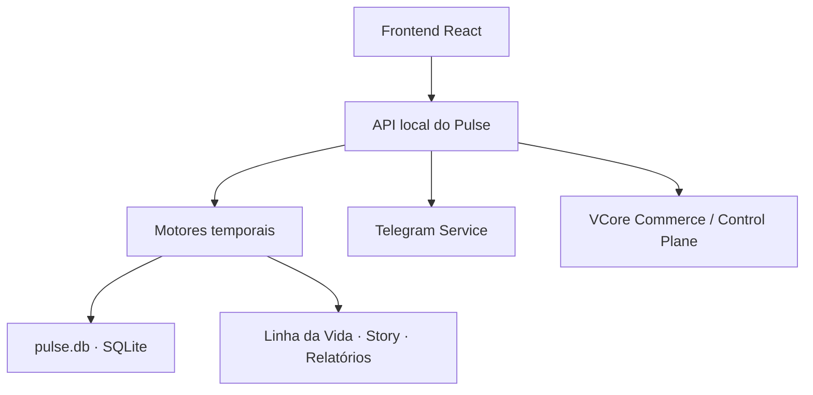

# Arquitetura

O VCore Pulse adota uma arquitetura local-first. Coleta, interpretação e memória permanecem na máquina observada.

## Frontend

Interface executiva apresentada no navegador local. Ela consome somente a API do Pulse e não coleta hardware diretamente.

## API local

Coordena leitura da Home, relatórios, diagnóstico, backup, licença e Telegram. Por padrão, o instalador vincula o serviço a `127.0.0.1:4173`.

## Motores Pulse

Transformam telemetria em Integridade, Elasticidade, Resiliência, Entropia, baseline operacional, padrões diários, previsões, recomendações, eventos e narrativas.

## Banco local

O arquivo `pulse.db` preserva telemetria, históricos, Linha da Vida, Stories, configurações e aprendizado. Ele fica fora da pasta do aplicativo para sobreviver a atualizações e desinstalações padrão.

## Telegram

Opera por fila, deduplicação, retry e limite de envio. A integração é opcional e configurada pelo usuário.

## Commerce

Licenciamento, Trial, pagamento e ativação são validados pelo VCore Commerce. O Pulse não recebe credenciais bancárias e não conversa diretamente com o provedor Pix.
