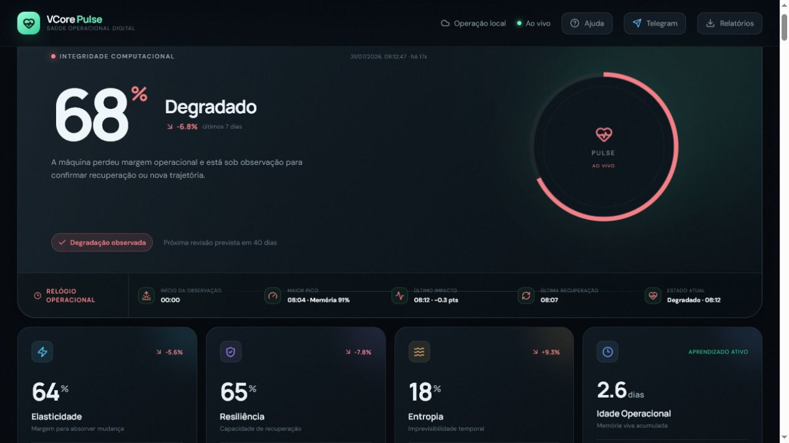
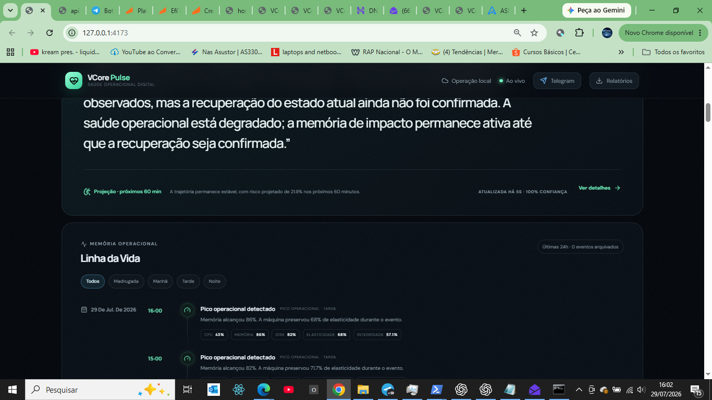
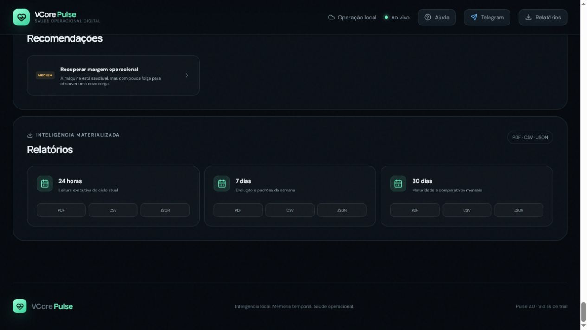

# VCore Pulse 2.2 使用手冊

🇧🇷 [Português](manual.pt-BR.md) · 🇺🇸 [English](manual.en.md) · 🇪🇸 [Español](manual.es.md) · 🇨🇳 [简体中文](manual.zh-Hans.md) · 🇹🇼 **繁體中文**

**讓機器擁有運作記憶。** Pulse 觀察資源使用情況，串連變化、影響與恢復過程，保留理解機器運作所需的脈絡。作業系統可以改變，運作記憶的理念始終如一。

> 2026 年 9 月 28 日版。本文介紹 Pulse 2.2，**2.2 下載尚未開放**。本手冊為後續使用提供指引，不代表平台已通過驗收或已正式商用。請查看[平台狀態](platforms-2.2.md)。本儲存庫僅提供公開文件，不包含私有引擎原始碼。

## 1. 安裝前的準備

版本開放後，請僅從[官方網站](https://www.voigtcore.com.br/?lang=zh-Hant#pulse22-manual)或[官方發布頁面](https://github.com/VoigtCore/VCore-PULSE/releases)下載。核對版本、作業系統、處理器架構及發布狀態。舊版下載即使與本手冊同時出現，也仍然是其標示的版本。

Windows x64 與 Windows ARM64 不同。Intel Mac 與 Apple Silicon Mac 需要不同的套件。Linux ARM64 是下一階段的優先目標，並非已通過驗收的平台。

## 2. 在 Windows 上安裝或更新

1. 待相應版本開放後，關閉 Pulse，執行適合該系統的安裝程式。
2. 使用原安裝所用的 Windows 使用者帳戶；本機金鑰保護與該使用者相關。
3. 等待安裝完成，透過捷徑開啟 **VCore Pulse 2.2**。
4. 瀏覽器會開啟本機面板 `http://127.0.0.1:4173`。此位址指目前這台電腦，而不是區域網路中的另一台機器。
5. 檢查版本、資料蒐集狀態及歷史紀錄。剛開始觀察的機器需要時間累積運作軌跡。

更新時不要刪除資料，也不要複製其他電腦的資料庫來取代目前資料庫。安裝失敗時，請保留錯誤代碼及提示中的 `install.log`，然後聯絡支援。不要修改資料庫結構來繞過檢查。

v11 候選版本修正了已審核升級路徑中，舊安裝缺少發布清單時的辨識問題。`UPDATE_INSTALL_SCHEMA_UNKNOWN` 仍會阻止未知內部版本；先前發生錯誤的電腦仍需重新驗證。

## 3. 認識主面板

本手冊使用先前公開的真實擷取畫面。2.2 的介面可能有所不同，這些圖片不能作為新安裝程式已通過驗收的證據。

- **運作健康狀態：** 根據觀察到的資料提供整體概覽與脈絡。
- **變化回應與恢復：** 顯示機器如何應對變化並恢復日常行為。
- **不穩定性：** 觀察期間偵測到的波動。
- **歷史紀錄：** 可用運作記憶的時間跨度與連續性。關機時間不等於持續觀察。
- **處理程序與資源：** CPU、記憶體、磁碟及該平台可用感測器的資料。

高評分不保證不會發生故障。Pulse 協助解讀證據，不能取代備份、防毒軟體或負責團隊的判斷。

## 4. 閱讀圖表與運作軌跡

選擇可用的時間範圍，串連變化、影響與恢復。依日期或時段查看紀錄，區分單次事件與重複模式。圖表反映測量值的變化趨勢；請同時留意脈絡與樣本數量。樣本不足時，比較結果應顯示為無法提供，而不是推斷機器運作正常。

歷史紀錄與該機器的身分關聯。切換語言不會建立新身分，也不會改變既有紀錄。

## 5. 報告、通知與語言

選擇可用週期以查看或產生報告。Pulse 2.2 改進了週期比較、執行摘要及運作事件說明，讓圖表與實際發生的情況建立關聯。沒有樣本的時段不能被當作正常運作的證據。

電子郵件與 Telegram 傳送功能需要明確設定。確認收件者並檢查傳送結果；提出傳送要求不等於訊息已送達。

面板支援**葡萄牙語、英語、西班牙語、簡體中文與繁體中文**。在面板中選擇語言後，資料與機器身分保持不變。

## 6. 試用、授權與付款

請以產品中顯示的最新條款為準。目前文件中的方案包括 10 天試用，以及每台機器每月 R$ 79,90 的 Pulse Solo；付款前請核對金額、期限與可用性。

1. 開啟購買授權或續訂授權選項。
2. 填寫購買者資訊及稅務地址，核對方案與期限。
3. 選擇 **Pix**，要求產生 QR Code 與可複製的付款代碼。依提示確認電子郵件，然後返回 Pulse。
4. 在銀行應用程式中核對收款人與金額後再付款。
5. 等待確認，或使用已付款檢查選項。顯示 QR Code 本身不會啟用授權。

**信用卡：** 付款在 C6 的安全結帳頁面完成。本機 Pulse 面板不要求填寫卡號、有效期限或 CVV。

**已選擇信用卡，現在想改用 Pix？** 使用結束未付款嘗試並選擇 Pix 的操作。應用程式會等待銀行確認。已付款、處理中或結果不確定的嘗試，都不能自動觸發新的收費。確認結束後，重新核對資訊並要求產生 Pix。

若授權透過電子郵件送達，請依照郵件指引操作。能夠使用某台電腦，不代表有權存取其他客戶的商業帳戶。

## 7. 關閉、重新啟動與保留運作記憶

維護前請使用 Pulse 的結束功能，再透過捷徑重新開始觀察。資料庫寫入期間不要刪除資料庫檔案或強制終止處理程序。

產品可能將較早的時段整理為歷史檔案。不要刪除歷史分段、控制紀錄或受保護的材料。匯出報告不等於完整備份。還原資料或移轉至其他使用者、電腦時，需要遵循支援流程，並確保相應金鑰可用。

## 8. Linux 與 macOS

候選套件已產生，但仍需針對各平台驗收。本輪已驗證的 SQLCipher 配接器是 Windows x64 版本；Linux 仍需原生配接器與金鑰管理驗證，macOS 需要在 Mac 上測試。不要透過關閉加密來宣稱安裝成功。在尚未驗證備份與回復舊版流程之前，不要用候選套件取代正在運作的安裝。

## 9. VLP 與後續發展

VLP 為生態系統整合提供身分與權限基礎。安裝 Pulse 不會自動連線至 VCore Server。每項整合都取決於版本、設定及驗證狀態。

下一步優先考慮 Linux ARM64，其後是 Windows ARM64。FreeBSD 與企業 Unix 系統屬於取決於需求的未來方向，並非目前支援的平台。

## 10. 聯絡支援

- 安裝與使用：[suporte@voigtcore.com.br](mailto:suporte@voigtcore.com.br)。
- 授權與購買：[comercial@voigtcore.com.br](mailto:comercial@voigtcore.com.br)。
- 整合：[engenharia@voigtcore.com.br](mailto:engenharia@voigtcore.com.br)。

請提供系統、架構、版本/build、操作及錯誤代碼。不要公開密碼、金鑰、權杖、運作資料庫或完整付款資料。分享紀錄檔之前請先檢查內容。
